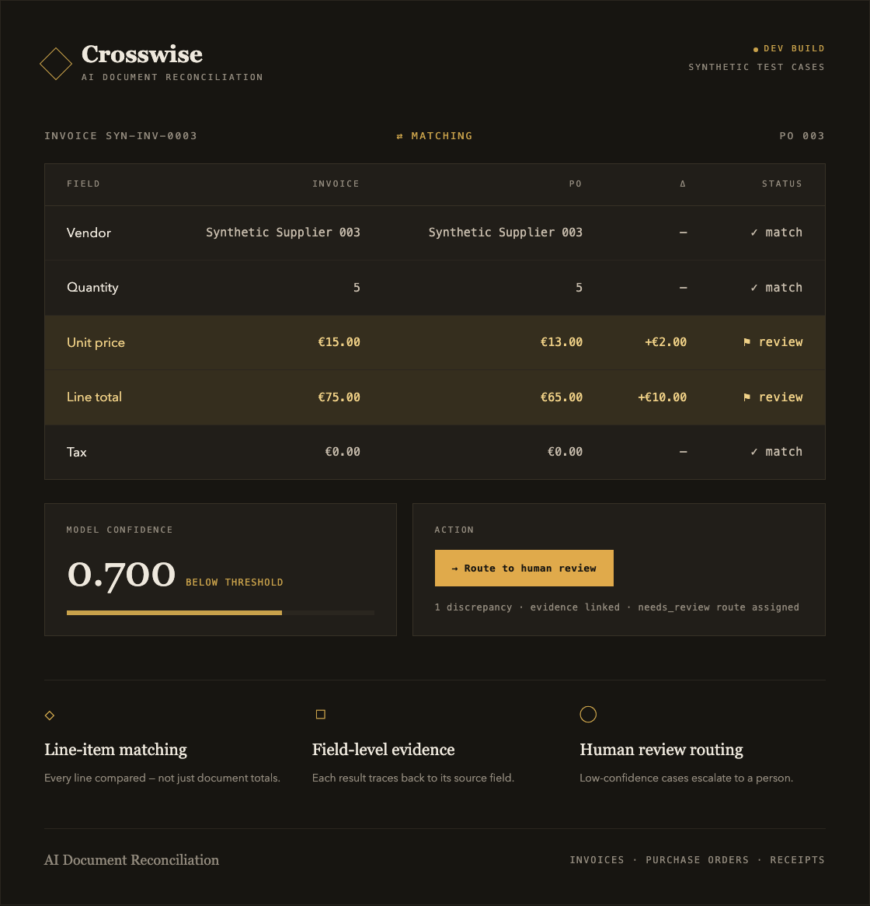
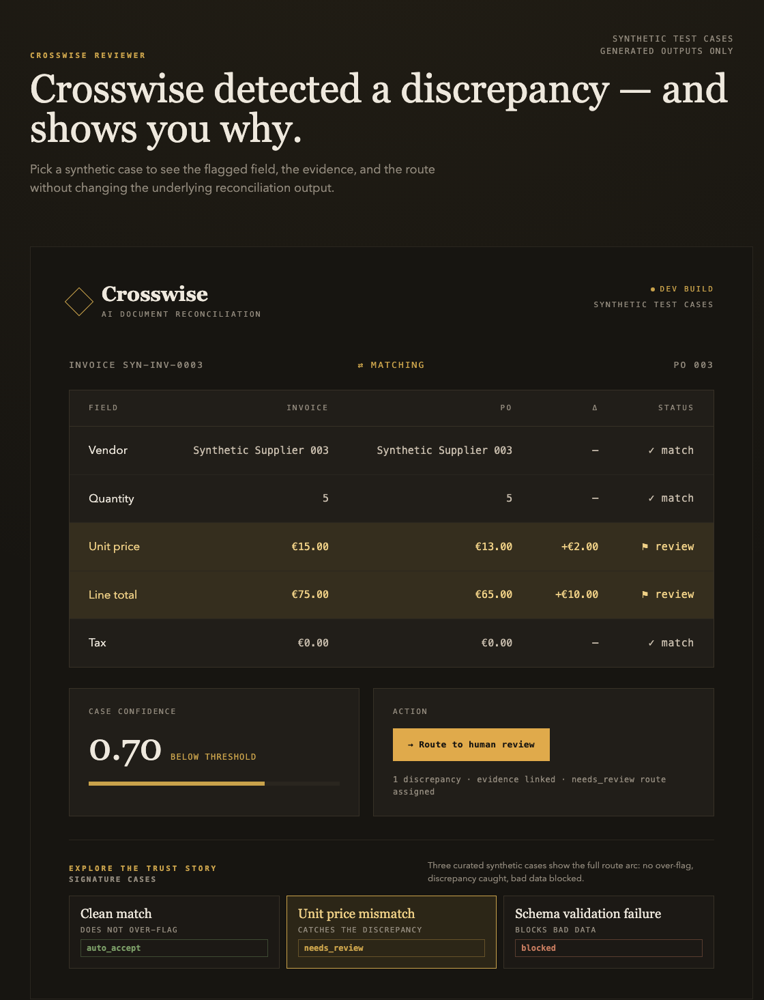
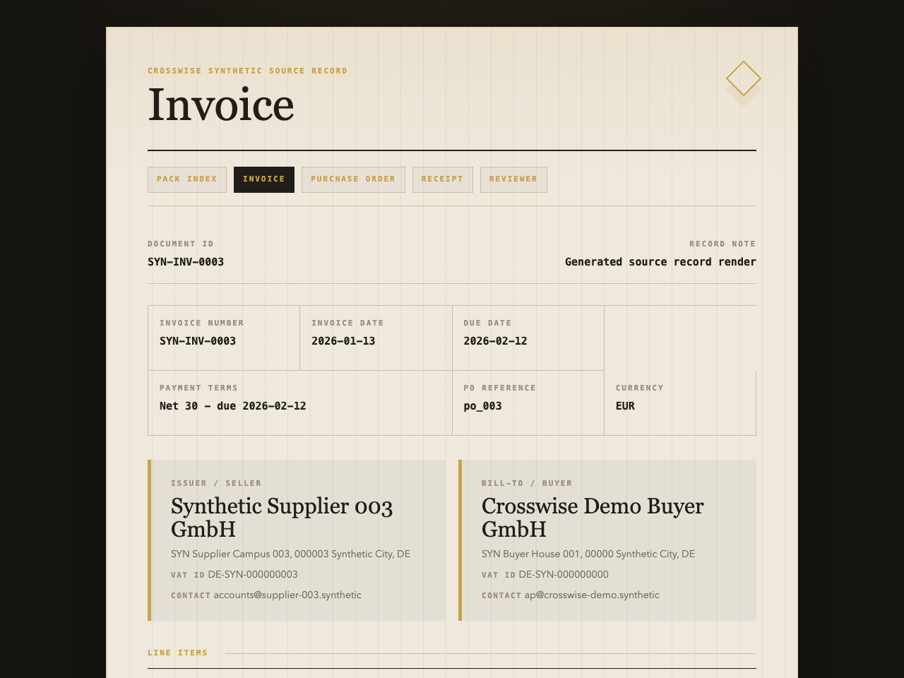
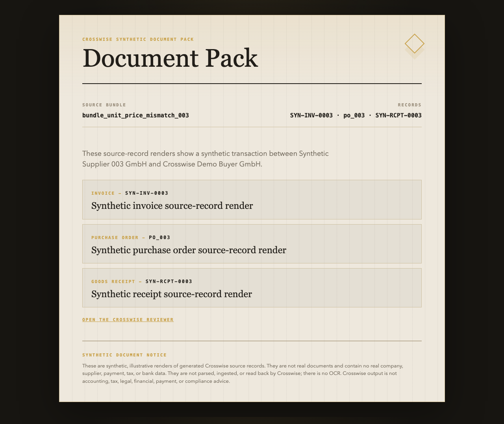

# Crosswise



AI Document Reconciliation

Crosswise is an AI document reconciliation system for invoice, purchase order, and receipt workflows. It is designed to:

- transform invoices, purchase orders, and receipts into structured records;
- perform line-item reconciliation across documents;
- detect discrepancies and suspicious cases;
- preserve evidence for reconciliation decisions;
- route uncertain cases to human review;
- measure reliability at the field and discrepancy level.

## What Crosswise Does

Crosswise runs a fully local, synthetic invoice / purchase order / receipt workflow. It generates structured document records, validates and normalizes them, reconciles line items across documents, detects controlled discrepancy labels, evaluates those labels against generated ground truth, assigns deterministic reliability routes, and produces both a Markdown evidence report and a static reviewer interface.

The current implementation is deterministic and synthetic-data-only. It is built to demonstrate document reconciliation, evidence-backed review, and reproducible evaluation without OCR, live APIs, model calls, real documents, or autonomous business actions.

## Key Capabilities

- Structured Data Extraction
- Line-Item Matching
- Discrepancy Detection
- Confidence Routing
- Field-Level Evidence
- Human Review Workflow
- Static Reviewer Interface

## Current Status

Completed local portfolio demo

- Visual prototype completed.
- Project foundation completed.
- Slice 0 technical contract completed.
- Slice 1 synthetic data generation completed.
- Slice 2 schema validation and normalization completed.
- Slice 3 reconciliation baseline completed.
- Slice 4 evaluation harness completed.
- Slice 5 confidence routing and reliability layer completed.
- Slice 6 local evidence report completed.
- Slice 7 static reviewer interface completed.
- Slice 8 README demo polish and fresh-clone reproduction path completed.
- Slice 9 document-panel reviewer completed.
- Slice 10 interactive reviewer (offline, self-contained case explorer) completed.
- Synthetic document pack completed.

## Screenshots


Reviewer discrepancy view with a unit-price mismatch routed to human review.



Static, offline case explorer for generated synthetic reconciliation cases.



Synthetic invoice source-record render with two-party identity and PO reference.



Offline document-pack index linking the invoice, purchase order, receipt, and reviewer.

## Fresh-Clone Quickstart

From the repository root:

```bash
python3 -m pip install -e ".[dev]"
python3 scripts/generate_synthetic_data.py
python3 scripts/validate_fixtures.py
python3 scripts/run_reconciliation.py
python3 scripts/evaluate_reconciliation.py
python3 scripts/score_reliability.py
python3 scripts/generate_report.py
python3 scripts/generate_reviewer.py
python3 -m pytest
```

Expected high-level result:

- fixture validation passes with `0` failures;
- reconciliation produces `10` cases;
- evaluation reports perfect deterministic baseline metrics: precision `1.0`, recall `1.0`, F1 `1.0`, and macro F1 `1.0`;
- reliability produces `1` `auto_accept`, `8` `needs_review`, and `1` `blocked`;
- tests pass.

You can also run the artifact-generation pipeline with one command:

```bash
python3 scripts/run_full_pipeline.py
```

## Generated Outputs

- `data/synthetic/fixtures_v1_0.json` — deterministic synthetic invoice, purchase order, receipt, supplier, SKU, bundle, and discrepancy fixtures.
- `data/ground_truth/ground_truth_v1_0.json` — generated answer key for expected labels, routes, and evidence references.
- `data/reconciliation/reconciliation_v1_0.json` — deterministic reconciliation cases and evidence-backed detected labels.
- `data/evaluation/evaluation_v1_0.json` — precision, recall, F1, macro F1, per-label metrics, and confusion accounting.
- `data/reliability/reliability_v1_0.json` — confidence scores, reliability routes, review reasons, blocked reasons, and non-advice reminders.
- `docs/evidence/CROSSWISE_LOCAL_EVIDENCE_REPORT_v1.0.md` — reviewer-readable Markdown evidence report.
- `docs/evidence/crosswise_reviewer_v1_0.html` — self-contained static HTML reviewer interface.
- `docs/evidence/CROSSWISE_REVIEWER_DISCREPANCY_SHOWCASE.png` — generated screenshot of the document-panel discrepancy view.
- `docs/evidence/CROSSWISE_REVIEWER_INTERACTIVE_SHOWCASE.png` — generated screenshot of the interactive case explorer on a selected discrepancy case.
- `docs/evidence/documents/index.html` — synthetic document pack index linking the invoice, purchase order, and receipt renders.
- `docs/evidence/documents/invoice.html` — standalone synthetic invoice source-record render.
- `docs/evidence/documents/purchase_order.html` — standalone synthetic purchase order source-record render.
- `docs/evidence/documents/receipt.html` — standalone synthetic receipt source-record render.
- `docs/evidence/CROSSWISE_DOCUMENT_PACK_SHOWCASE.png` — generated screenshot of the synthetic document pack.

## Open the Static Reviewer

On macOS:

```bash
open docs/evidence/crosswise_reviewer_v1_0.html
```

Cross-platform fallback:

Open `docs/evidence/crosswise_reviewer_v1_0.html` in a browser.

## Current Pipeline

1. Generation creates deterministic synthetic invoice / purchase order / receipt fixtures and ground truth.
2. Validation checks schema structure, references, arithmetic, dates, currency, taxonomy, and synthetic-only constraints.
3. Reconciliation matches suppliers, documents, and line items, then emits detected discrepancy labels and evidence.
4. Evaluation compares detected labels against generated ground truth and reports discrepancy metrics.
5. Reliability scoring assigns deterministic confidence scores and routes cases to `auto_accept`, `needs_review`, or `blocked`.
6. Report generation writes the local Markdown evidence report.
7. Static reviewer generation writes the self-contained local HTML reviewer interface.

## Local Development

```bash
python3 -m pip install -e ".[dev]"
python3 -m pytest
python3 scripts/run_full_pipeline.py
python3 scripts/generate_synthetic_data.py
python3 scripts/validate_fixtures.py
python3 scripts/run_reconciliation.py
python3 scripts/evaluate_reconciliation.py
python3 scripts/score_reliability.py
python3 scripts/generate_report.py
python3 scripts/generate_reviewer.py
```

## Documentation

- [Slice 0 Technical Contract](docs/plans/CROSSWISE_SLICE_0_TECHNICAL_CONTRACT_AND_SYSTEM_SPECIFICATION_v1.0.md)
- [Evidence Index](docs/evidence/INDEX.md)
- [Local Evidence Report](docs/evidence/CROSSWISE_LOCAL_EVIDENCE_REPORT_v1.0.md)
- [Static Reviewer HTML](docs/evidence/crosswise_reviewer_v1_0.html)
- [Reviewer Discrepancy Showcase](docs/evidence/CROSSWISE_REVIEWER_DISCREPANCY_SHOWCASE.png)
- [Reviewer Interactive Showcase](docs/evidence/CROSSWISE_REVIEWER_INTERACTIVE_SHOWCASE.png)
- [Synthetic Document Pack Index](docs/evidence/documents/index.html)
- [Synthetic Invoice Render](docs/evidence/documents/invoice.html)
- [Synthetic Purchase Order Render](docs/evidence/documents/purchase_order.html)
- [Synthetic Receipt Render](docs/evidence/documents/receipt.html)
- [Synthetic Document Pack Showcase](docs/evidence/CROSSWISE_DOCUMENT_PACK_SHOWCASE.png)

## Design Prototype

- [Prototype ZIP](assets/prototypes/crosswise-prototype.zip)

## Data Policy

- Synthetic data only.
- No PII.
- No real invoices.
- No real purchase orders.
- No real receipts.
- No real company data.
- No real supplier data.
- No payment information.
- No tax identifiers.
- No bank details.

## Non-Goals

Crosswise is not:

- accounting software;
- tax software;
- legal advice;
- financial advice;
- payment automation;
- autonomous approval software;
- a source of accounting, tax, legal, financial, payment, or compliance advice;
- an autonomous action system.
