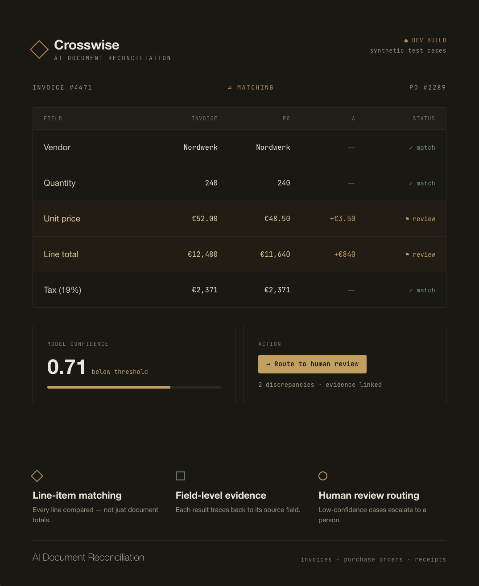

# Crosswise



AI Document Reconciliation

Crosswise is an AI document reconciliation system for invoice, purchase order, and receipt workflows. It is designed to:

- transform invoices, purchase orders, and receipts into structured records;
- perform line-item reconciliation across documents;
- detect discrepancies and suspicious cases;
- preserve evidence for reconciliation decisions;
- route uncertain cases to human review;
- measure reliability at the field and discrepancy level.

## Key Capabilities

- Structured Data Extraction
- Line-Item Matching
- Discrepancy Detection
- Confidence Routing
- Field-Level Evidence
- Human Review Workflow

## Current Status

Early Development

- Visual prototype completed.
- Project foundation completed.
- Slice 0 technical contract completed.
- Slice 1 synthetic data generation completed.

## Local Development

```bash
python3 -m pip install -e ".[dev]"
python3 -m pytest
python3 scripts/generate_synthetic_data.py
```

## Documentation

- [Project Foundation](docs/plans/CROSSWISE_PROJECT_SYNTHESIS_AND_FOUNDATION_v1.0.md)
- [Slice 0 Technical Contract](docs/plans/CROSSWISE_SLICE_0_TECHNICAL_CONTRACT_AND_SYSTEM_SPECIFICATION_v1.0.md)

## Design Prototype

- [Prototype ZIP](assets/prototypes/crosswise-prototype.zip)

## Data Policy

- Synthetic data only.
- No PII.
- No real invoices.
- No real company data.

## Non-Goals

Crosswise is not:

- accounting software;
- tax software;
- legal advice;
- financial advice;
- payment automation;
- autonomous approval software.
